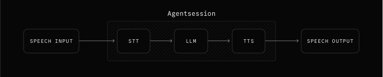

# VoiceAI

VoiceAI is an advanced voice assistant application that leverages OpenAI's GPT and TTS/STT capabilities to provide seamless voice interactions over your knowledge base. It integrates with FAISS and BM25 for efficient document retrieval and uses LangChain for enhanced conversational AI capabilities using RAG.

## Features

- **Voice Interaction**: Near Real-time voice-to-text and text-to-speech capabilities using OpenAI's APIs.
- **Conversational AI**: Powered by OpenAI's GPT models for natural and context-aware conversations.
- **Multi-Channel Support**: Handles audio input and provides audio responses.
- **Document Retrieval**: Combines FAISS and BM25 for efficient and accurate document retrieval.
- **Customizable Prompts**: Tailored system prompts for specific use cases.

## Models (OpenAI)

- **STT**: `gpt-4o-mini-transcribe`
- **LLM**: `gpt-4o-mini`
- **TTS**: `gpt-4o-mini-tts`

## Pipeline


## Installation

1. Clone the repository:
   ```bash
   git clone <repository-url>
   cd voiceai
   ```

2. Create a virtual environment and activate it, please use `uv`:
   ```bash
   uv sync
   ```

4. Set up environment variables:
   - Create a `.env` file in the root directory.
   - Add your OpenAI API key:
     ```env
     OPENAI_API_KEY=your_openai_api_key
     ```

## Usage

1. Start the application:
   ```bash
   cd src
   uv run app.py
   ```

2. Access the Gradio interface at `http://localhost:7860`.

## Project Structure

```
voiceai/
├── src/
│   ├── app.py                # Main application file
│   ├── rag.py                # Retrieval-Augmented Generation (RAG) implementation
│   ├── prompts.py            # System prompts for AI models
│   ├── data/
│   │   ├── Agent's manual.txt # Sample data for document retrieval
│   │   └── faiss_index/      # FAISS index files
├── requirements.txt          # Python dependencies
├── pyproject.toml            # Project metadata and dependencies
├── .env                      # Environment variables
├── README.md                 # Project documentation
```

## Key Components

### RAG (Retrieval-Augmented Generation)
- Combines FAISS and BM25 for document retrieval.
- Splits documents into chunks for efficient processing.
- Retrieves relevant documents based on user queries.

### Prompts
- **TTS_SYSTEM_PROMPT**: Defines the behavior and scope of the voice assistant.
- **RAG_SYSTEM_PROMPT**: Tailored for answering questions using retrieved documents.

### App
- Handles voice input and output using OpenAI's APIs.
- Integrates RAG for context-aware responses.
- Provides a Gradio-based user interface for interaction.

## Dependencies

- Python >= 3.13
- OpenAI API
- FAISS
- LangChain
- Gradio
- Rank-BM25
